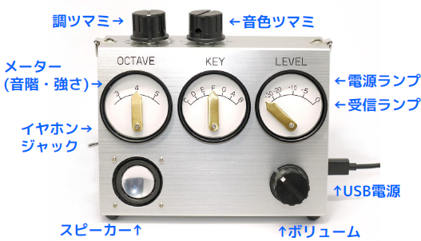

# RadiOrgan (らじおるがん)
ラジコンのプロポで演奏する楽器
## 概要
- [ラジコンで演奏する楽器](https://www.slideshare.net/lipoyang/ss-106010077)

## ソフトウェア
- マイコン: GR-CITRUS (ルネサス RX631)
- 開発環境: IDE for GR v1.03
- 使用ライブラリ: [PWMeter for GR-CITRUS](https://github.com/lipoyang/PWMeter4Citrus), [Simple YMF825 driver](https://github.com/lipoyang/SimpleYMF825)
- ソースコード: [RadiOrgan.ino](RadiOrgan.ino), [RadiOrgan.h](RadiOrgan.h)
## 回路図
(作成中)
## 筐体

## プロポと受信機
- プロポ : SANWA MT-44
- 受信機 : SANWA RX-481
## プロポの設定
- SYSTEM > BIND
    - RF MODE : FH4T
    - TELEMETRY : OFF
    - RESPONCE MODE
        - ST : SHR
        - TH : SHR
        - AUX1 : SHR
        - AUX1 : SHR

以上の設定で受信機とBINDする。

- SYSTEM > AUX TYPE
    - AUX1: STEP : 5
    - AUX2: STEP : 5
- AUX
    - AUX1: H100
    - AUX2: L100
- SYSTEM > KEY ASSIGN
    - SW1: AUX1 : PUSH
    - SW2: AUX2 : PUSH

以上の設定で、SW1(側面の下のほうのスイッチ)を押すとAUX1チャンネルにH50の信号が出る。
また、SW2(側面の上のほうのスイッチ)を押すとAUX2チャンネルにL50の信号が出る。
SW1、SW2を離したときは、各々のチャンネルには0の信号が出る。
これらの信号をオクターブ上げ下げの指令に用いる。
